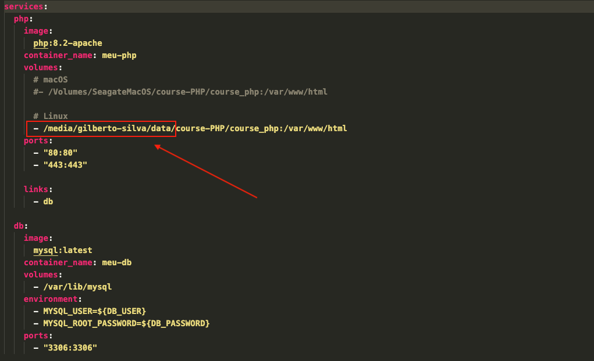

[Português Brasileiro](https://github.com/Gilberto-Mascena/course-PHP/blob/main/README.md) |
[English](https://github.com/Gilberto-Mascena/course-PHP/blob/main/README-en.md)

[](https://Gilberto-Mascena/course-PHP)
[](https://github.com/Gilberto-Mascena/course-PHP/blob/main/LICENSE.md)
[](https://github.com/Gilberto-Mascena/course-PHP/stargazers)
[](https://github.com/Gilberto-Mascena/course-PHP/issues)
[](https://github.com/Gilberto-Mascena/course-PHP/releases)


# *PHP 8 course*

## *Technologies used*

- [PHP](https://www.php.net)
- [Maven](https://maven.apache.org)
- [Docker](https://www.docker.com/products/docker-desktop/)
- [Docker engine para Linux](https://docs.docker.com/engine/install/)
- [Docker HUB](https://hub.docker.com)
- [JavaScript](https://developer.mozilla.org/pt-BR/docs/Web/JavaScript)
- [HTML](https://developer.mozilla.org/pt-BR/docs/Web/HTML)
- [CSS](https://developer.mozilla.org/pt-BR/docs/Web/CSS)
- [Git](https://git-scm.com)

---

## *How to run the project*

### *Requirements:*

- [Docker](https://www.docker.com/products/docker-desktop/) 
- [Docker engine for Linux](https://docs.docker.com/engine/install/)

> [!IMPORTANT]
> _In docker-compose.yml, change the project path_



#### *On **Linux** navigate to the `course_php` directory and create a `.env` file and enter your database credentials, now run the command below to create the containers*

```
docker compose up -d
```

- _To stop the container_
    - _Run the command below_

```
docker compose stop
```
- _To start the container_
    - _Run the command below_


```
docker compose start
```

## *Dependencies*

### *PDO and MySQLi to connect to MySQL*

*_run the command below in the container and restart:_*

```
docker compose exec php docker-php-ext-install pdo pdo_mysql mysqli
```

*_If you get an error installing the extension on Ubuntu 24.04 LTS, download a newer PHP-Apache image from [*Docker HUB*](https://hub.docker.com/r/thekingscode/php8.2-apache)_*

---


## *License* 

*The* [*MIT License*](LICENSE.md) (*MIT*)

*Gilberto | Dev 2023*